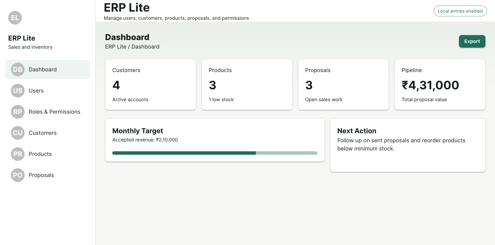
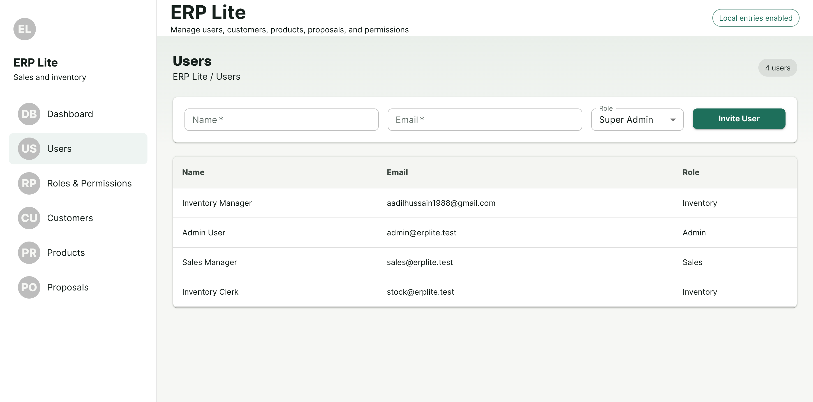
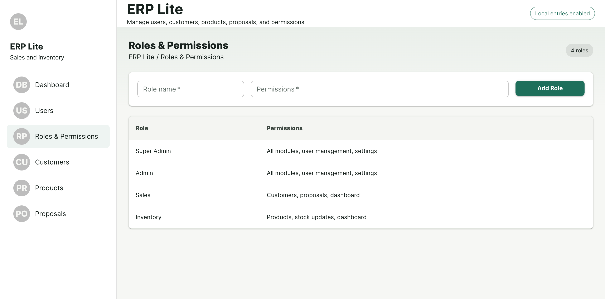
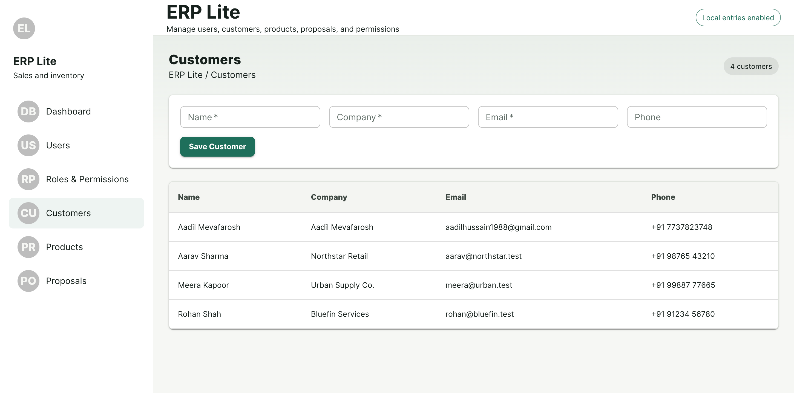
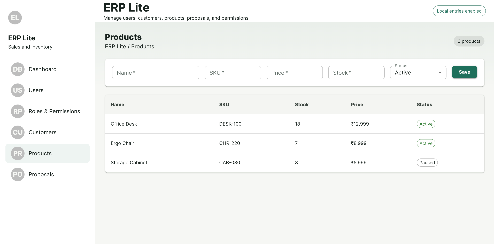
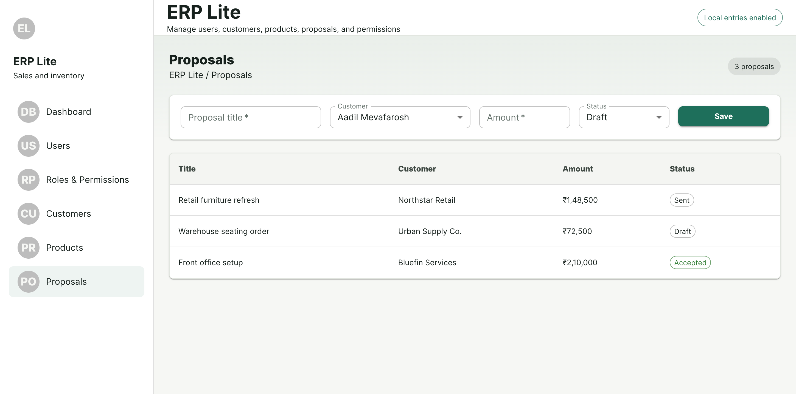

# ERP Lite

A lightweight ERP (Enterprise Resource Planning) application built with **React**, **Vite**, and **Material UI (MUI)** for managing users, roles, customers, products, inventory, and sales proposals.

## Overview

ERP Lite provides a simple and modern interface for small businesses to manage their sales and inventory operations. The application includes role-based access management, customer management, product inventory tracking, proposal generation, and business performance insights through a dashboard.

---

## Features

### Dashboard
- Business overview with key metrics
- Total customers count
- Total products count
- Active proposals count
- Total proposal value
- Monthly revenue target progress
- Suggested next actions
- Export dashboard data

### User Management
- Invite and manage users
- Assign roles during user creation
- View all registered users
- Role-based access structure

### Roles & Permissions
- Create custom roles
- Define module permissions
- Pre-configured roles:
  - Super Admin
  - Admin
  - Sales
  - Inventory
- Centralized permission management

### Customer Management
- Add new customers
- Store company information
- Manage customer contact details
- Customer listing with search-friendly structure

### Product Management
- Add and manage products
- Track inventory levels
- Low stock monitoring
- Inventory overview

### Proposal Management
- Create sales proposals
- Associate proposals with customers
- Set proposal amounts
- Manage proposal statuses:
  - Draft
  - Sent
  - Accepted
- View proposal history

### Sales & Inventory Tracking
- Monitor active sales opportunities
- Inventory stock management
- Low-stock alerts
- Revenue tracking

---

## Tech Stack

### Frontend
- React
- Vite
- Material UI (MUI)
- JavaScript (ES6+)

### UI Components
- Material UI Components
- Material UI Data Tables
- Material UI Forms
- Material UI Layout System

### State Management
- React Hooks
- Context API (if implemented)

---

## Project Structure

```bash
src/
│
├── components/
│   ├── Dashboard/
│   ├── Users/
│   ├── Roles/
│   ├── Customers/
│   ├── Products/
│   └── Proposals/
│
├── layouts/
│
├── pages/
│
├── services/
│
├── data/
│
├── hooks/
│
├── App.jsx
├── main.jsx
└── routes.jsx
```

---

## Screens Included

### Dashboard
- KPI Cards
- Monthly Target Progress
- Pipeline Value
- Next Action Recommendations

### Users
- User Invitation Form
- User Listing Table
- Role Assignment

### Roles & Permissions
- Role Creation
- Permission Assignment
- Role Listing

### Customers
- Customer Creation Form
- Customer Directory

### Products
- Product Management
- Stock Tracking
- Inventory Monitoring

### Proposals
- Proposal Creation
- Customer Association
- Status Tracking
- Proposal Listing

---

## Installation

### Clone Repository

```bash
git clone https://github.com/your-username/erp-lite.git
cd erp-lite
```

### Install Dependencies

```bash
npm install
```

### Start Development Server

```bash
npm run dev
```

Application will be available at:

```bash
http://localhost:5173
```

---

## Build for Production

```bash
npm run build
```

Preview production build:

```bash
npm run preview
```

---

## Current Functionality

✅ Dashboard Analytics

✅ User Management

✅ Roles & Permissions

✅ Customer Management

✅ Product Addition

✅ Product Listing

✅ Inventory Tracking

✅ Proposal Addition

✅ Proposal Status Management

✅ Revenue Calculation

✅ Low Stock Monitoring

✅ Material UI Responsive Interface

---

## Future Enhancements

- Authentication & Authorization
- JWT-Based Login
- Backend API Integration
- Database Persistence
- Customer Search & Filters
- Product Categories
- Proposal PDF Export
- Email Notifications
- Sales Reports
- Inventory Reports
- Dark Mode Support
- Audit Logs
- Multi-Tenant Support

---

## UI Highlights

- Clean Material UI Design
- Responsive Layout
- Sidebar Navigation
- Dashboard Analytics Cards
- Data Tables
- Form Validation
- Modern Business Workflow

---

## Author

Developed using React, Vite, and Material UI as a lightweight ERP solution for sales and inventory management.


## Screenshots

### Dashboard


### Users Management


### Roles & Permissions


### Customers Management


### Products Management


### Proposals Management
